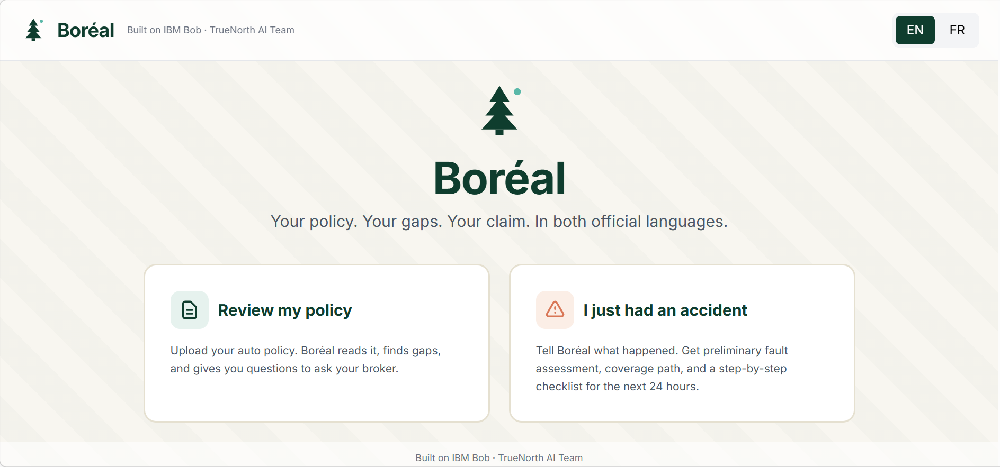

# Boréal 🌲

> **Your policy. Your gaps. Your claim. In both official languages.**

A bilingual AI insurance advisor that reads your policy, scores your coverage gaps, and walks you through a claim — in authentic Canadian English or regulatory French.

**IBM Bob-a-thon submission** · Built natively on IBM Bob + Context Studio · TrueNorth AI Team

---

## What is Boréal?

Boréal is a multi-agent AI system for Canadian auto insurance that does two things most consumer AI tools cannot:

1. **Pre-loss gap analysis** — upload your policy, answer 3 questions about your life, get a coverage gap report with the exact questions to ask your broker.
2. **Post-loss claim guidance** — describe what happened (or pick a scenario), get a preliminary fault assessment using Ontario's Fault Determination Rules, the coverage path, and a 24-hour action checklist.

Both flows are end-to-end bilingual — built on a 280+ term EN/FR regulatory terminology framework, not on machine translation.

---

## The 30-second pitch

- 🇨🇦 **Bilingual moat** — authentic Canadian regulatory French (*Avenant FPQ n° 44R, Indemnités d'accident bonifiées, IDDM*), built from in-domain Canadian P&C regulatory documentation. Not Google Translate.
- 🤖 **Genuinely agentic** — 4 coordinated agents (Triage → Policy Reader / Coverage Advisor / Claim Prep) with versioned system prompts, structured YAML handoffs, and explicit hard rules. Not one chatbot.
- 🎯 **Two complete flows** — most submissions stop at *summarize this document*. Boréal goes to *what do I do now, at the scene of an accident, at midnight?*
- 🧭 **Calibrated honesty** — when input is ambiguous, Boréal asks for clarification instead of guessing. When Ontario's fault rules contain edge cases (swerved-vs-impacted in an animal strike), Boréal flags the caveat explicitly.
- 🔒 **Security-first** — uses `.bobignore` + protected-file approval to prevent reading raw PII. The Policy Reader Agent redacts the insured's name, address, VIN, and policy number before any analysis.

---

## Project structure

```
boreal-bobathon/
├── README.md                              ← you are here
├── .bobignore                             ← security configuration
│
├── docs/
│   ├── README.md
│   └── demo-script.md                     ← 4-minute video script (v2)
│
├── context/
│   ├── README.md
│   └── context-studio-config.md           ← persona, guardrails, terminology, tone
│
├── agents/
│   ├── README.md
│   ├── 01-triage-agent.md                 ← language + province + intent routing (v1)
│   ├── 02-policy-reader-agent.md          ← PDF parsing → structured coverage + PII redaction (v2)
│   ├── 03-coverage-advisor-agent.md       ← 13 gap rules, 3-question flow, bilingual templates (v2)
│   └── 04-claim-prep-agent.md             ← Ontario FDR principles, 13 loss scenarios, bilingual (v2)
│
├── prototype/
│   ├── README.md
│   └── boreal-prototype.html              ← interactive bilingual prototype, 10 screens (v6)
│
├── demo/
│   ├── README.md
│   ├── boreal-test-policy.pdf             ← fictional Maple Mutual policy (Jean-Pierre Tremblay)
│   └── boreal-demo.mp4                    ← 4-minute submission video
│
└── submission/
    ├── README.md
    └── pitch.md                           ← one-page judges' brief
```

---

## How to evaluate this submission

**Suggested order (≈ 17 minutes to a complete picture):**

1. **Read** `submission/pitch.md` — the one-page elevator pitch *(3 min)*
2. **Watch** `demo/boreal-demo.mp4` — the 4-minute demo video *(4 min)*
3. **Open** `prototype/boreal-prototype.html` in a browser — click through both flows yourself, toggle EN ↔ FR *(5 min)*
   - Try the **Review my policy** flow: click *Use the sample policy* → analyze
   - Try the **I just had an accident** flow: click the *I hit a deer on the highway* chip
   - Try typing a vague description like *"I had a fender bender"* — see the calibrated clarification screen
4. **Skim** `agents/04-claim-prep-agent.md` — see the Ontario FDR logic, the loss-to-coverage mapping, and the bilingual output templates *(3 min)*
5. **Skim** `context/context-studio-config.md` — see the bilingual terminology framework that powers the moat *(2 min)*

---

## How Boréal maps to Bob-a-thon scoring criteria

### ✅ Spec-driven development

Every agent has a versioned system prompt with explicit role, inputs, outputs, hard rules, and edge cases. See:

- `agents/02-policy-reader-agent.md` v2 — 385 lines, 5-pass extraction methodology, PII redaction patterns, YAML schema, worked example
- `agents/03-coverage-advisor-agent.md` v2 — 268 lines, 13 gap rules with severity scoring, full EN/FR output templates
- `agents/04-claim-prep-agent.md` v2 — 341 lines, 13 loss scenarios with Ontario FDR principles, bilingual templates

Hard scope boundaries are non-negotiable: **Ontario auto, English + French, no pricing, no legal advice, no policy binding.** Defined in `context/context-studio-config.md` Section 2 (Hard Guardrails).

### ✅ Context Studio engineering

The `context/context-studio-config.md` defines:
- Persona (warm, knowledgeable, plain-speaking, never paternalistic)
- Provincial regulatory framework (Ontario auto policy structure, OAP-1, OPCF endorsement codes)
- Bilingual terminology framework (~280 verified term pairs drawn from authoritative Canadian P&C regulatory sources)
- Tone and disclaimer rules (every advisory response ends with the educational-guidance disclaimer)
- Hard guardrails (the things Boréal will never do)

### ✅ Agentic design

Four coordinated agents with explicit handoffs:

| Agent | Role | Handoff |
|---|---|---|
| **Triage** | Detects language + province + intent (`policy_review` / `coverage_gap` / `claim_prep`) | Routes to one of the three specialists |
| **Policy Reader** | Parses PDF → structured YAML, redacts PII | Hands structured policy to Coverage Advisor |
| **Coverage Advisor** | Applies 13 gap rules against policy + 3 lifestyle answers → severity-scored gap report | Terminal output (gap report → user) |
| **Claim Prep** | Classifies loss, applies Ontario FDR, maps to coverage path, generates 24-hour checklist | Terminal output (claim guidance → user) |

### 🔒 Security-first

Boréal handles personally identifiable information from insurance policies. The project uses Bob's `.bobignore` mechanism plus the Policy Reader Agent's PII redaction (insured name, address, policy number, VIN, driver's license, DOB) to prevent the AI from outputting raw customer data — only sanitized, redacted summaries reach downstream agents.

---

## Demo flow (4 minutes)

| Scene | Time | Highlights |
|---|---|---|
| 1 | 0:00–0:25 | Hook — Canadian bilingual insurance pain |
| 2 | 0:25–1:00 | Upload Maple Mutual policy → Policy Reader extracts, PII redacted |
| 3 | 1:00–1:50 | 3 lifestyle Qs → Coverage Advisor gap report with broker questions |
| 4 | 1:50–2:30 | Switch to Claim Prep flow → "I hit a deer" scenario |
| 5 | 2:30–3:00 | Calibrated AI — fault caveat (swerved-vs-impacted) + 24-hour checklist |
| 6 | 3:00–3:25 | Toggle FR — same claim guidance in authentic regulatory French |
| 7 | 3:25–3:50 | Bob's three pillars — quick cutaway to agent specs + context config |
| 8 | 3:50–4:00 | Vision close — province-by-province expansion, TrueNorth AI Team |

Full script: `docs/demo-script.md`.

---

## Reusability for IBM Consulting

Boréal's architecture is **immediately reusable** across Canadian financial services:

- **P&C insurers** — every Canadian carrier has a bilingual obligation. Boréal's terminology framework + agent topology can be repointed at any line of business.
- **Banks** — cross-border bilingual compliance needs (CDIC disclosures, OSFI guidelines). Same Triage → Specialist pattern.
- **Operational adjacencies** — the agent pattern transfers cleanly to claims triage, underwriting intake, fraud screening, complaint routing.
- **The bilingual regulatory terminology framework is asset-grade reusable IP** — applicable beyond auto to property, tenant, life, commercial lines, and group benefits.

---

## Scope discipline

**In scope (built and demonstrable):**
- Ontario auto insurance
- English + French
- Four agents (Triage v1, Policy Reader v2, Coverage Advisor v2, Claim Prep v2)
- Two complete flows (pre-loss gap analysis + post-loss claim guidance)
- Three claim scenarios (rear-end collision, animal strike, vandalism)

**Out of scope (architecture-ready, not built):**
- Other provinces (config-driven; would inherit the framework)
- Home, tenant, commercial, life lines (same agent topology, different context)
- Pricing, quoting, policy binding — *regulatory boundaries Boréal will never cross.* This is education, not advice.

---

## Why a Canadian P&C practitioner built this

Boréal was built by an IBM Consulting practitioner with **13+ years of cross-sector Canadian P&C experience**, including national-scale regulatory data quality and bilingual reporting work for major Canadian insurers. The bilingual terminology framework draws on authoritative Canadian regulatory documentation, Ontario Auto Reform materials, and in-domain practitioner knowledge.

This isn't a generic LLM demo dressed in maple leaves. It's an authentic Canadian insurance product spec, built by someone who lives in the regulatory world it serves.

---

## Built on Bob

Boréal runs natively on IBM Bob + Context Studio:

- All four agent system prompts are designed for Bob's agent runtime
- The `context/context-studio-config.md` is the literal Context Studio configuration
- The `.bobignore` mechanism is used for runtime security
- The prototype is a portable HTML mockup that runs the same logic as the agent specs — clickable in any browser, no backend required

The prototype is the *judges' walkthrough surface*. Bob is the *production runtime*. Same specs, two delivery modes.

---

## Submission package

| File | Purpose |
|---|---|
| `docs/demo-script.md` | Word-for-word 4-minute video script (v2) |
| `context/context-studio-config.md` | Persona, guardrails, terminology, tone, response templates |
| `agents/01-triage-agent.md` → `04-claim-prep-agent.md` | System prompts for each agent |
| `prototype/boreal-prototype.html` | 1,000-line interactive bilingual mockup, 10 screens |
| `demo/boreal-test-policy.pdf` | Fictional 3-page Ontario auto policy (Maple Mutual / Jean-Pierre Tremblay) |
| `demo/boreal-demo.mp4` | 4-minute submission video |
| `.bobignore` | Security configuration |
| `submission/pitch.md` | One-page judges' brief |
| `README.md` | Project overview & navigation *(this file)* |

---

**Boréal — built on Bob. Pour vrai.**

*TrueNorth AI Team · May 2026*
