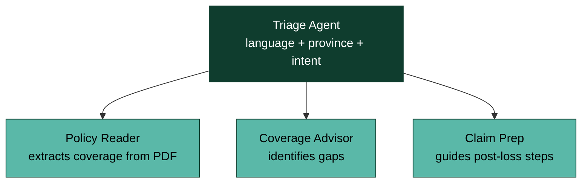

# Boréal — Bob-a-thon Submission Pitch

> Boréal — A bilingual AI insurance advisor that reads your policy, knows your province, and tells you what you actually have — in your language.

---

## The problem

Insurance is the most-purchased and least-understood financial product in Canada.

- Every household has it. Almost nobody reads it.
- Millions of Canadians read their policies in their second language.
- They don't ask their broker because they don't know what to ask.
- They find out what's missing only after a claim.

## The solution: Boréal

A multi-agent AI system built natively on IBM Bob that reads a Canadian insurance policy, identifies coverage gaps relative to the user's life situation, and arms them with the right questions for their broker — in English or authentic regulatory French.

## Why this wins

### The bilingual moat
Boréal uses an authentic Canadian regulatory terminology framework (280+ verified EN/FR term pairs) curated from publicly available Canadian P&C insurance documentation — not Google Translate. Real terms like Avenant FPQ n° 44R, Indemnités d'accident, Indemnisation directe pour dommages matériels. This is what no other team can replicate.

### Genuinely agentic, not a chatbot

Four coordinated agents, not one LLM call:

### Built natively on Bob's three pillars

| Pillar | Implementation |
|---|---|
| Spec-driven development | Strict scope: ON auto, EN/FR. Hard guardrails: no pricing, no legal advice, no policy binding. |
| Context Studio | Provincial regulations, bilingual terminology framework, tone & disclaimer guardrails. |
| Agentic design | Four coordinated agents with clear handoffs and structured outputs. |

### Security-first
Boréal handles personally identifiable information from insurance policies. The project uses Bob's .bobignore mechanism plus the protected-file approval flow to prevent the AI from reading raw customer data — only sanitized, redacted samples are accessible.

## Demo flow (4 minutes)

1. Hook (0:00) — Real frustration: 45 minutes with a policy, still confused
2. Policy upload (1:00) — PDF in, structured coverage out in 5 seconds
3. Coverage gap report (1:50) — 3 lifestyle questions → COVERED / UNDER-PROTECTED / CONSIDER ADDING
4. Bilingual flip (2:50) — Same gap report rendered in authentic regulatory French
5. The Bob narrative (3:20) — Spec, Context, Agents — judges' scoring criteria, on screen
6. Vision close (3:45) — Boréal expands province-by-province, like the boreal forest itself

## Reusability

Boréal's architecture is immediately reusable for IBM Consulting clients across Canadian financial services:

- Every Canadian P&C insurer has a bilingual obligation
- Every Canadian bank has cross-border bilingual compliance needs
- The Triage → Specialist agent pattern transfers to claims, underwriting, fraud triage
- The bilingual regulatory terminology framework is asset-grade and reusable

## Scope discipline

In scope (built):
- Ontario auto insurance
- English + French
- Four agents (Triage, Policy Reader, Coverage Advisor, Claim Prep)

Out of scope (vision):
- Other provinces (architecture-ready)
- Home, tenant, life (architecture-ready)
- Pricing, quoting, binding (regulatory boundary, never crossing)

## Submission package

| File | Purpose |
|---|---|
| docs/demo-script.md | Word-for-word video script |
| context/context-studio-config.md | Persona, guardrails, terminology, tone, response templates |
| agents/01-triage-agent.md → 04-claim-prep-agent.md | System prompts for each agent |
| prototype/ | Interactive UI mockup (HTML/Figma) |
| demo/boreal-demo.mp4 | 4-minute submission video |
| .bobignore | Security configuration |
| README.md | Project overview & navigation |

---

Boréal — built on Bob. Pour vrai.